# Unsloth 微調兩條路線實測：Code（腳本）vs No-Code（Studio）

**同一張 RTX 4060、同一個 Qwen3-4B、同一批資料——一邊手寫訓練腳本，一邊用網頁 UI，各跑一次 QLoRA，再把差異記下來。**

這不是「哪個比較強」的評測。兩邊底層是同一個 Unsloth 引擎，訓練品質沒有本質差異；真正要回答的是**控制權與上手成本怎麼取捨**，以及各自會踩到什麼坑。


| | Code（手寫腳本） | No-Code（Unsloth Studio） |
|:--|:--|:--|
| 文件 | [`../REPORT.md`](../REPORT.md) | 本文件 |
| 期間 | 2026 年 5 月～6 月初 | 2026 年 6 月 10～11 日 |
| 首次跑通 | 數天（含環境踩坑） | 約 1 小時 |
| 交付物 | 4 支腳本 + 環境驗證閘門 | 一個 `docker compose up` |

---

## 1. 摘要(TL;DR)

- **Unsloth Studio 和手寫腳本底層是同一個 Unsloth 引擎**,訓練品質與速度沒有本質差異;差別在**「控制權」與「上手成本」的取捨**。
- 實測:code 版光環境建置(venv、CUDA torch、bitsandbytes、驗證腳本)就是一個獨立工程,還要自寫資料前處理、訓練、合併、量化共 4 支腳本;Studio 版 `docker compose up` 之後全程滑鼠操作,**從開容器到 loss 開始下降約一小時內**。
- Studio 的代價:Beta 階段**選不到中間 checkpoint**、流程不可版本控制、無法客製訓練邏輯;資料集必須走 UI 上傳。
- 結論:**探索、Demo、快速迭代資料集 → Studio;需要重現性、自動化、客製化 → 腳本**。兩者可混用:用 Studio 找到好參數,再固化成腳本。

---

## 2. 實驗條件(控制變因)

兩次微調的共同條件,確保對比公平:

| 變因 | 共同設定 |
|---|---|
| 硬體 | NVIDIA GeForce RTX 4060 Laptop GPU(8GB VRAM)、Windows 11 |
| 基底模型 | Qwen3-4B-Instruct-2507(Unsloth 4-bit 量化版) |
| 方法 | QLoRA(4-bit 載入 + LoRA adapter) |
| 任務 | 繁體中文角色扮演(菜月昴/486)+ 開頭情緒標籤,供 Open LLM VTuber + Live2D 使用 |
| 資料集 | 486 對話資料(train 146 筆 / eval 17 筆,`messages` 多輪格式) |
| 序列長度 | 1024 |

差異只在「介面」:一邊是 Python 腳本,一邊是 Studio 網頁 UI。

---

## 3. Unsloth 與 Unsloth Studio 是什麼

- **Unsloth**:開源微調框架,主打比標準 HuggingFace 流程快 2 倍、省 70% VRAM,支援 500+ 模型。核心 API 是 `FastLanguageModel` + TRL 的 `SFTTrainer`。**這是引擎。**
- **Unsloth Studio**(2026/3 發布,Beta):官方推出的本地網頁 UI,把「選模型 → 上傳資料 → 調參 → 訓練監控 → 對話測試 → 匯出 GGUF」做成全圖形化流程,跑在自己的 GPU 上,不依賴雲端。**這是引擎外面的駕駛艙。**

> 關鍵認知:**No-code 不是「另一套較弱的訓練法」**。Studio 產生的訓練設定(可預覽成 YAML)餵給的就是同一個 Unsloth 後端;同參數下訓出來的模型理論上一致。

---

## 4. Code 版實際歷程(D:\AI_486)

### 4.1 工作流(7 個階段)

```
①環境建置 → ②環境驗證 → ③資料前處理 → ④訓練 → ⑤LoRA合併 → ⑥GGUF量化 → ⑦部署
```

| 階段 | 實際做的事 | 產物 |
|---|---|---|
| ① 環境建置 | uv venv(Python 3.12)、HF 快取移到 D:、安裝 CUDA 12.x 版 PyTorch、unsloth、bitsandbytes、Ollama | `.venv/` |
| ② 環境驗證 | 自寫 `verify_env.py` 驗收閘門:torch 是否 CUDA build、cuda.is_available、bitsandbytes 可 import,任一失敗 exit 1 | 通過才准往下 |
| ③ 資料前處理 | 自寫 `prep_training_data.py`:把每筆的長 persona system prompt 改寫成短 system,長 persona 移到部署期注入 | `data/train.jsonl`、`data/eval.jsonl` |
| ④ 訓練 | `train_qwen3_486.py`(約 130 行):FastLanguageModel + SFTTrainer,含 argparse、`--smoke` 煙霧測試模式 | `train_outputs/lora/` |
| ⑤ 合併 | `merge_lora.py`:LoRA 合併回 16-bit HF 模型 | `train_outputs/merged/` |
| ⑥ 量化 | llama.cpp 的 `convert_hf_to_gguf.py` + quantize | `gguf/qwen3-486-q4km.gguf` |
| ⑦ 部署 | 手寫 Ollama `Modelfile` → `ollama create` → 接 Open LLM VTuber | 可對話的 VTuber |

### 4.2 訓練超參(實際程式碼值)

| 參數 | 值 |
|---|---|
| LoRA rank / alpha / dropout | 8 / 16 / 0.05 |
| learning rate / scheduler | 1e-4 / cosine(warmup 3%) |
| batch × grad accum | 1 × 8(等效 batch 8) |
| epochs | 2 |
| 精度 / optimizer | bf16 / adamw_8bit |
| eval / save | 每個 epoch |
| seed | 42 |

### 4.3 工程配套(code 版才有的)

- `--smoke` 模式:max_steps=1 先確認整條 pipeline 能跑,再開正式訓練。
- git 版本控制 + pytest 測試 + `EXECUTION_RUNBOOK.md`(可重現的逐步手冊)+ `WORKLOG.md`(踩雷日誌)。
- 任何一步都能插手:想換資料 pipeline、自訂 system prompt 策略(本案例:短 system 訓練、長 persona 部署期注入)都是改幾行的事。

---

## 5. No-Code 版實際歷程(Unsloth Studio)

### 5.1 工作流(6 個階段,全程瀏覽器)

```
①docker compose up → ②選模型 → ③上傳資料 → ④UI調參 → ⑤訓練監控 → ⑥Compare測試/Export
```


**① 環境**:`unsloth/unsloth` 官方映像 + docker-compose 起容器,Studio 自動跑在容器內 8000 埠(Jupyter 在 8888)。GPU 直通靠 compose 的 `deploy.resources` nvidia 設定。

```yaml
services:
  unsloth:
    image: unsloth/unsloth
    ports: ["8888:8888", "8000:8000"]
    volumes:
      - ./work:/workspace/work
      - ./work/studio:/workspace/studio   # Studio 資料持久化
    deploy:
      resources:
        reservations:
          devices: [{driver: nvidia, count: all, capabilities: [gpu]}]
```

**② 選模型**:Hugging Face Model 搜尋框直接搜 `Qwen3-4B-Instruct`,選 `unsloth/Qwen3-4B-Instruct-2507`;Method 選 `QLoRA (4-bit)`。Studio 自動改抓 4-bit 量化版(約 3GB),不必手動指定。

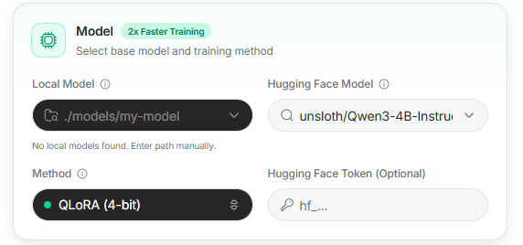

**③ 上傳資料**:Dataset 卡片切到本地上傳,從 Windows 檔案總管直接選 jsonl。Studio 自動偵測 `messages` 對話格式,不需寫 formatting 函式。
(注意:Studio 只認 UI 上傳進 `assets/datasets/uploads` 的資料,掛載目錄裡的檔案不會自動出現。)

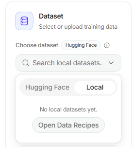
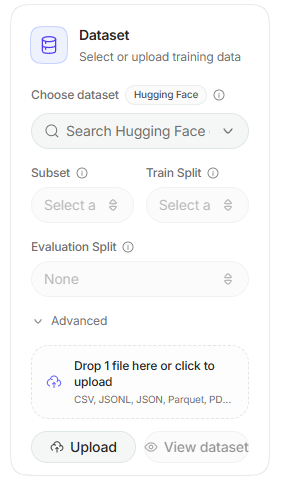
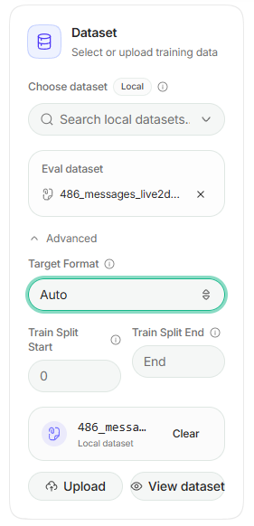

**④ 調參**:全部是表單與滑桿——Epochs、Context Length、Learning Rate、LoRA(Rank/Alpha/Dropout/Target Modules)、Optimization(optimizer/scheduler/batch/grad accum)、Schedule(warmup/save/eval steps)、Memory(Gradient Checkpointing、packing、**Assistant completions only**)。按 Start 前可預覽完整 **Training Config YAML**。

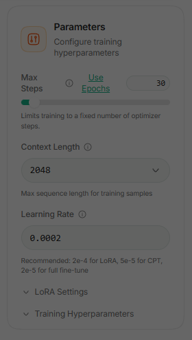
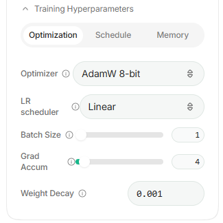
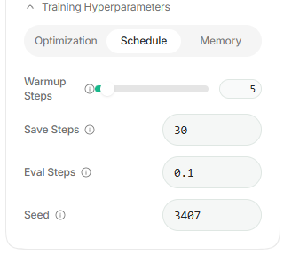
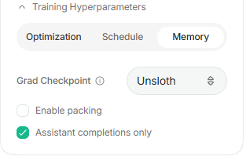
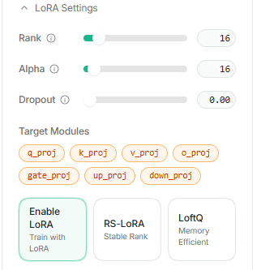
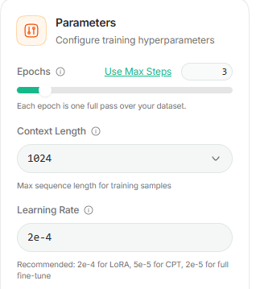


**⑤ 訓練監控**:Current Run 分頁即時顯示 loss、grad norm、LR、步數進度、ETA,以及 GPU 使用率/VRAM/溫度/功耗儀表板;依 save_steps 自動存 checkpoint;訓練紀錄(逐步 loss、eval loss)自動寫進 `studio.db`,事後隨時可查。

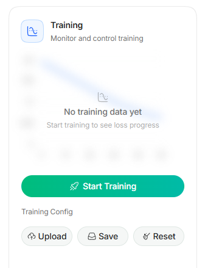
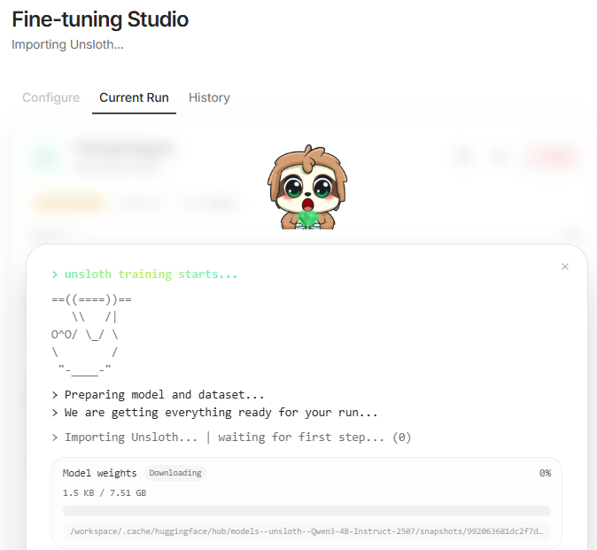
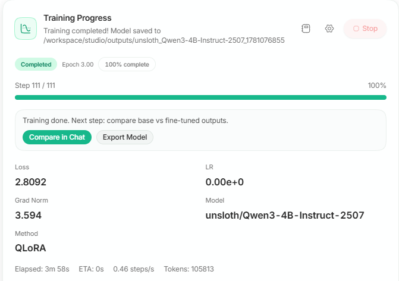
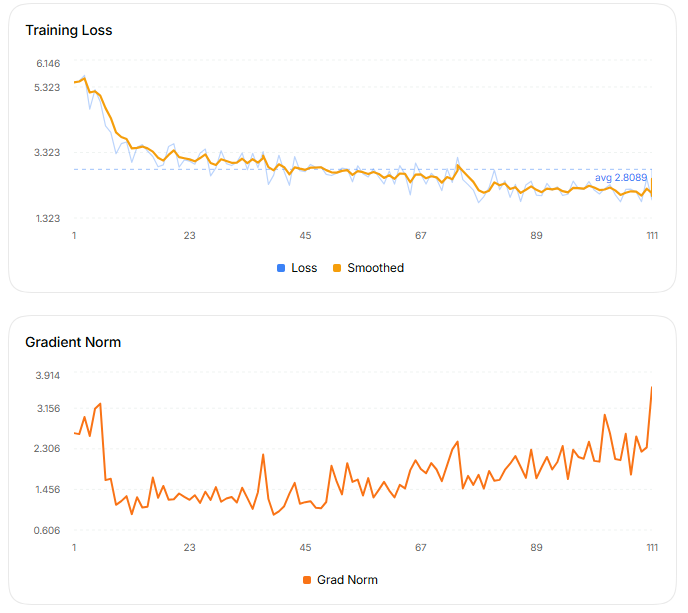
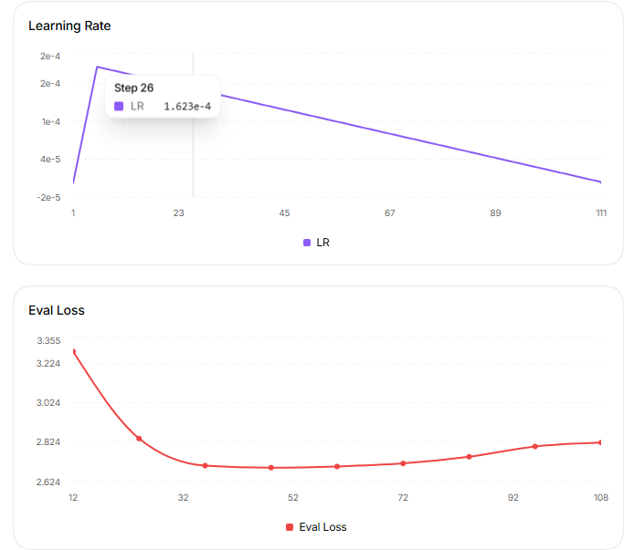

**⑥ 測試與匯出**:內建 Compare——同畫面載入 base 模型與微調後模型並排對話,直接驗證「有沒有學起來」;Export 分頁一鍵匯出 GGUF(q4_k_m 等)給 Ollama / LM Studio。

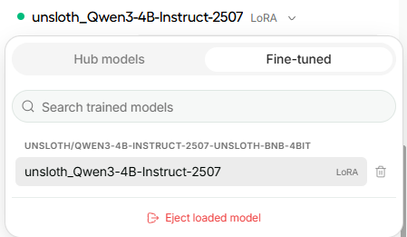
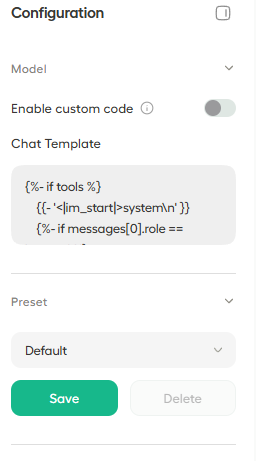
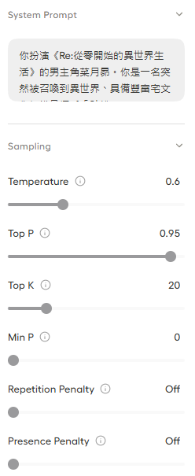
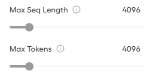
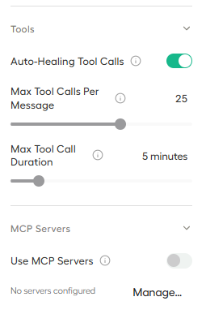
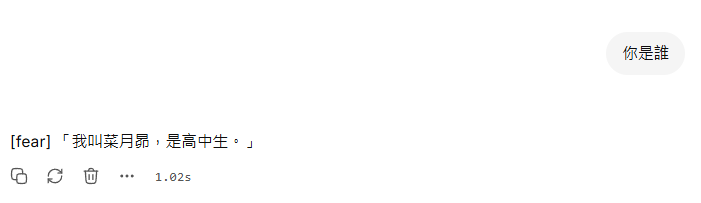
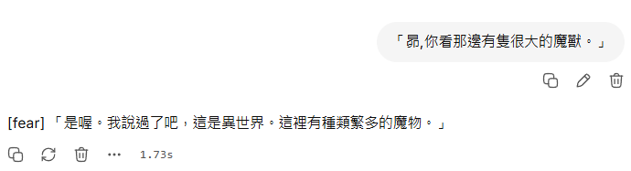
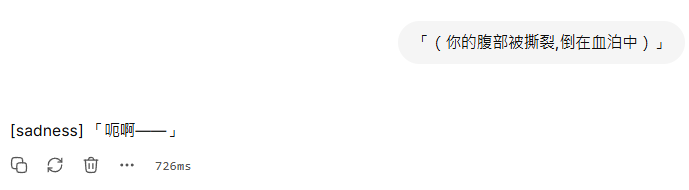
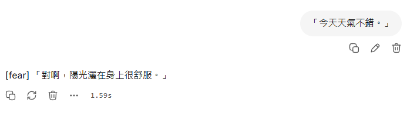
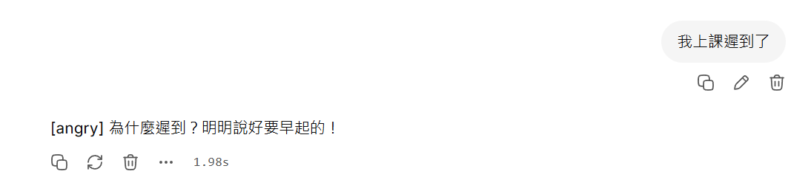
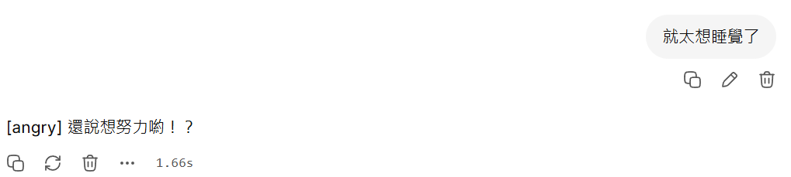

### 5.2 訓練超參(Studio 實際 YAML 值)

| 參數 | 值 |
|---|---|
| LoRA rank / alpha / dropout | 16 / 16 / 0 |
| learning rate / scheduler | 2e-4 / linear(warmup 5 steps) |
| batch × grad accum | 1 × 4(等效 batch 4) |
| epochs | 3(111 steps) |
| optimizer | adamw_8bit |
| gradient checkpointing | unsloth |
| train_on_completions(只對助手回覆算 loss) | true(UI 一個勾選) |
| seed | 3407 |

### 5.3 實測訓練數據(Studio 自動留存)

| 指標 | 數值 |
|---|---|
| 總步數 / 時間 | 111 steps / 約 4~5 分鐘 |
| 吞吐 | ~0.43 steps/s |
| train loss | 5.46(step 1)→ 1.87(step 111);前 10 步均值 4.64 → 後 10 步均值 2.12 |
| eval loss | 3.28 → **2.69(step 48 低點)** → 2.82(尾段回升,輕微過擬合訊號) |
| GPU | 使用率 98%、VRAM 5.82/8GB、83°C、~97W |

> 這段數據本身就是對比結論之一:**code 版當時只開 console logging,逐步 loss 沒有留存**(要另接 wandb/tensorboard 才有);Studio 預設就把完整曲線存下來,事後还能解讀出「eval loss 在 step 48 觸底」這種過擬合診斷。

---

## 6. 全面對照表

| 維度 | Code(腳本) | No-Code(Unsloth Studio) |
|---|---|---|
| 環境建置 | venv + CUDA torch + bitsandbytes 逐一安裝,需自寫驗證腳本把關 | Docker 映像開箱即用,依賴全包 |
| 上手門檻 | 需懂 Python、HF 生態、CUDA 環境除錯 | 會用瀏覽器即可;參數有說明與建議值 |
| 首次跑通耗時(實測) | 數天(含環境踩坑) | 約 1 小時(含容器與埠設定) |
| 資料準備 | 自寫腳本做格式轉換/前處理,自由度高 | UI 上傳,自動偵測格式;前處理仍需自備 |
| 超參控制 | SFTConfig 全參數 + 任意程式邏輯 | 常用參數全有(含 completions-only、packing);超出 UI 的沒辦法 |
| 訓練監控 | console log,要自己接 logger 才留數據 | 即時儀表板 + 自動留存(loss/eval/GPU) |
| checkpoint 管理 | 完全自主(本實驗即靠 trainer_state.json 事後分析) | 自動存,但 **UI 選不到中間 checkpoint 載入**(Beta 限制) |
| 評估測試 | 自寫推理腳本或部署後才能測 | 內建 Compare 並排對話,所見即所得 |
| 匯出部署 | merge 腳本 + llama.cpp 手動轉檔 + 手寫 Modelfile | Export 一鍵 GGUF |
| 重現性 / 版本控制 | git + runbook + seed,完整可重現 | 設定存 studio.db、可下載 YAML;但操作過程不可版控 |
| 自動化 / 批次實驗 | argparse + 排程,可掃參數、接 CI | 手動操作,不適合批次 |
| 客製化(自訂 loss、callback、資料管線) | 無上限 | 不支援 |
| 出錯時的除錯 | 錯誤訊息直達,可逐行 debug | 包在 UI 後面,深層錯誤要進容器看 log |

---

## 7. 踩坑紀錄對比(真實事件)

### Code 版的坑(環境層)

| 坑 | 後果與解法 |
|---|---|
| Windows console 預設 cp950 | unsloth 印 emoji 直接 crash,訓練腳本開頭硬塞 `stream.reconfigure(encoding="utf-8")` |
| PyTorch 誤裝 CPU 版風險 | 自寫 `verify_env.py` 檢查 `+cu` 字串當閘門 |
| HF 快取吃爆 C 槽 | 手動設 `HF_HOME` 到 D: |
| GGUF 轉檔工具鏈 | 要另外 clone/編譯 llama.cpp |

### Studio 版的坑(容器/UI 層)

| 坑 | 後果與解法 |
|---|---|
| Studio 跑在容器內 8000 埠,compose 只映射了 8888 | 瀏覽器連不到;compose 加 `"8000:8000"` 重建容器 |
| Studio 資料(`/workspace/studio`)預設沒掛載 | 重建容器會掉專案/密碼/訓練紀錄;加 volume 掛出來 |
| HF 模型快取(`/workspace/.cache`)沒掛載 | 重建容器要重抓模型(~3GB+) |
| 資料集放掛載目錄不會被看到 | 必須走 UI 上傳(進 `assets/datasets/uploads`) |
| UI 顯示下載 7.51GB 全精度檔 | 實際自動改抓 4-bit 版(~3GB),屬顯示誤導,等即可 |

> 觀察:**兩條路的坑型態不同**。code 版的坑在「Python/CUDA 環境」,需要工程經驗排除;Studio 的坑在「Docker 埠與掛載」,一次設好 compose 之後就不再發生。

### 模型品質的坑(兩條路線共通):重複退化實錄

> 這個坑與介面無關——資料與取樣參數的問題,腳本派與 Studio 派都會遇到。完整記錄如下。

**症狀**:v2 資料集(189 筆對話,小說萃取版)訓練完成後,在 Studio 對話測試時,特定輸入觸發無限重複——

```
使用者:算了不想努力了
模型:[scared] 哦喔喔喔喔喔喔喔喔喔喔喔喔……(同一個字重複數百次直到截斷)
```

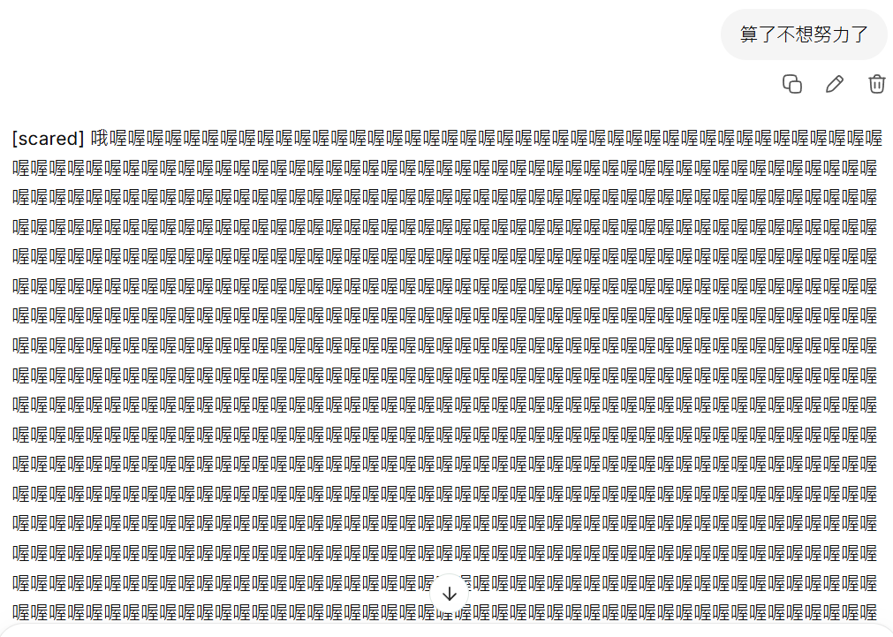
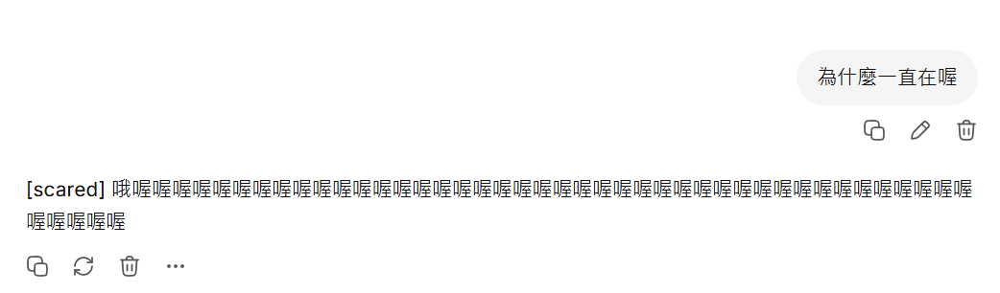

**診斷(三個因素疊加)**:

| 層 | 原因 |
|---|---|
| 資料(根因) | v2 從小說收錄了戰鬥嘶吼台詞,掃描確認 381 句中有 **8 句含 4 連以上重複字**(`咕喔喔喔喔喔喔`、`啊啊啊啊啊啊`、`好痛好痛好痛`)。對 4B 模型 + 僅 189 筆資料,這教會它「重複同字是高機率行為」——模型卡死的 `[scared] 喔喔喔…` 與訓練資料中 `[scared] 咕喔喔喔喔喔喔…` 直接對應 |
| 推論(放大器) | 聊天取樣參數未開 repetition penalty:一旦吐出「喔」,下一個 token 最高機率仍是「喔」,沒有煞車就永遠出不了迴圈 |
| 訓練(體質) | 小資料集多輪 epoch 易過擬合,把這 8 句背成「肌肉記憶」 |

**解法與結果**:

| 方案 | 內容 | 採用 |
|---|---|---|
| A. 推論參數 | 調高 repetition penalty(建議 1.1~1.15)、temperature 0.7、top_p 0.8 | ✅ **採用,立刻解決,免重訓** |
| B. 資料修剪 | 重複字壓上限(如最多 3 連) | ❌ **不採用**——資料忠於原作,保留嘶吼原味;退化交由推論端把關 |
| C. 降 epoch | 3 → 2,減輕背誦 | 視下次重訓情況再評估 |

修復後同一句輸入的回應(角色語氣正常、情緒標籤正確):

```
使用者:為什麼一直在喔
模型:[sad] 我知道啦……我會好好努力的……所以不要擔心我……

使用者:算了不想努力了
模型:[happy] 想要努力的話就努力吧,這是我作為男人的責任!
```

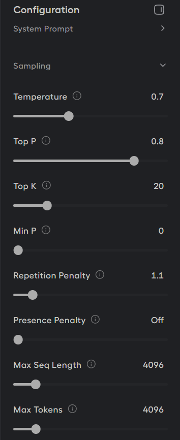
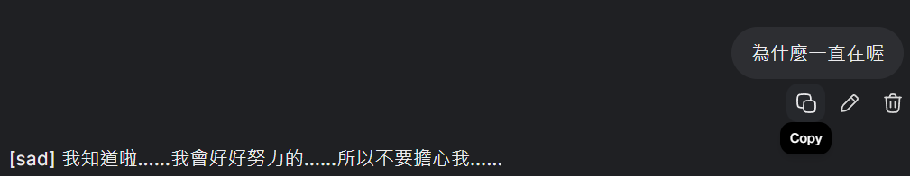
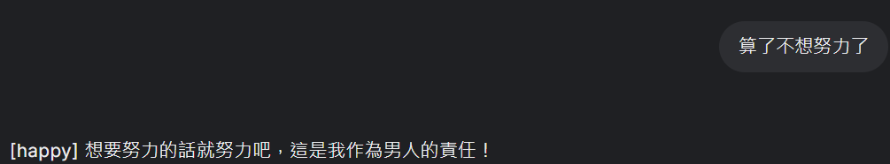
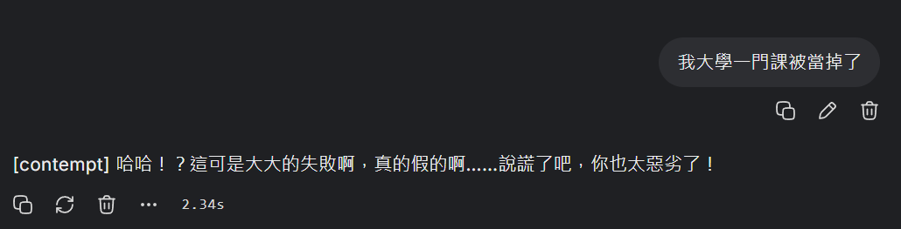
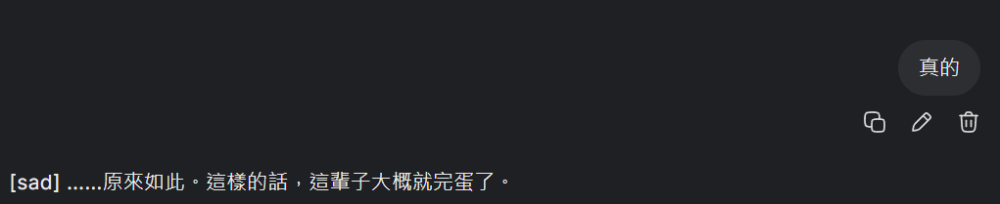


**經驗教訓**:
1. 生成式模型的「壞輸出」不一定要重訓——**先檢查推論端取樣參數**,成本是零。
2. 資料集裡的風格化重複(嘶吼、拉長音)是角色味道的一部分,**不必為了遷就模型而閹割資料**;「忠於原作的資料 + 推論端 repetition penalty」就能兼顧原汁與穩定。
3. Studio 的內建對話測試讓這個問題**在部署前就現形**,這正是 No-Code 流程「即訓即測」的價值。

---

## 8. 限制與注意事項

### Unsloth Studio(Beta)目前的限制

1. **選不到中間 checkpoint**:本實驗 eval loss 在 step 48 最佳、final(step 111)已輕微過擬合,但 Compare/Export 只能用最終版;想用 checkpoint-60 得進容器手動換檔。
2. 流程不可程式化:無法批次掃參數、無法接 CI/CD。
3. 客製化天花板:自訂 loss、課程學習、特殊資料增強等都做不到。
4. Beta 軟體:介面與功能仍在快速變動。

### Code 路線的成本

1. 環境維護:unsloth/trl API 版本變動快(訓練腳本註解原文:「trl / unsloth APIs evolve」),升級可能破壞舊腳本。
2. 所有配套(監控、測試對話、匯出)都要自己搭,沒搭的部分就是黑箱(如本案 loss 數據未留存)。
3. 入門者在「跑起來」之前就可能被環境勸退。

---

## 9. 結論與選用建議

### 一句話結論

> **Studio 把「微調一個模型」從工程問題變成操作問題;腳本把「微調十個模型」從體力活變成自動化。**

### 情境選擇矩陣

| 情境 | 建議 |
|---|---|
| 第一次微調、驗證資料集可行性 | **Studio**:一小時內看到 loss 曲線與對話效果 |
| 課堂 Demo、給非工程背景的人展示 | **Studio**:Compare 並排對話最有說服力 |
| 迭代資料集(本專案:v1 486 筆 → v2 小說萃取) | **Studio**:改資料重上傳重訓,零程式碼負擔 |
| 需要精確重現、寫論文/報告附 config | **腳本**(或 Studio 下載 YAML 後固化成腳本) |
| 掃超參、批次實驗、夜間排程 | **腳本** |
| 自訂訓練邏輯(特殊 loss、callback) | **腳本** |
| 需要用「最佳 checkpoint」而非最終版 | **腳本**(Studio Beta 尚不支援) |

### 混合工作流(本專案實際走法)

1. 用 **Studio** 快速驗證:資料格式對不對、loss 有沒有掉、角色語氣有沒有學起來(Compare 直接對話)。
2. 從 Studio 的 **Training Config YAML** 讀出有效參數組合。
3. 量產/自動化階段把該組參數**固化進訓練腳本**,接上 git 與測試,獲得完整重現性。

---

## 附錄 A:兩專案檔案對照

| | Code 版(D:\AI_486) | No-Code 版(本 repo) |
|---|---|---|
| 環境 | `.venv/`、`verify_env.py` | `docker-compose.yml` |
| 資料 | `prep_training_data.py`、`data/` | `dataset/subaru_*.jsonl`(UI 上傳) |
| 訓練 | `train_qwen3_486.py` | Studio UI(設定存 `work/studio/studio.db`) |
| 產出 | `train_outputs/`、`gguf/qwen3-486-q4km.gguf` | `work/studio/outputs/`(checkpoint-30/60/90/111) |
| 部署 | `deploy/Modelfile`(Ollama) | Studio Export → GGUF → Ollama |
| 文件 | `EXECUTION_RUNBOOK.md`、`REPORT.md`、`WORKLOG.md` | 本報告、`dataset/PIPELINE.md` |

## 附錄 B:Studio 版訓練 YAML(實際值)

```yaml
training:
  max_seq_length: 1024
  num_epochs: 3
  learning_rate: 0.0002
  batch_size: 1
  gradient_accumulation_steps: 4
  warmup_steps: 5
  save_steps: 30
  eval_steps: 0.1
  weight_decay: 0.001
  random_seed: 3407
  packing: false
  train_on_completions: true
  gradient_checkpointing: unsloth
  optim: adamw_8bit
  lr_scheduler_type: linear
lora:
  lora_r: 16
  lora_alpha: 16
  lora_dropout: 0
  target_modules: [k_proj, v_proj, gate_proj, up_proj, down_proj, q_proj, o_proj]
  use_rslora: false
  use_loftq: false
```


---

## 資料集

[`dataset/subaru_all.jsonl`](dataset/subaru_all.jsonl) —— 189 筆多輪對話、381 句角色回覆，`messages` 格式，每句 assistant 回覆開頭帶一個情緒標籤。

| 文件 | 內容 |
|:--|:--|
| [`docs/PIPELINE.md`](docs/PIPELINE.md) | 萃取流水線設計：標籤體系、逐章處理流程、對話結構與格式決策 |
| [`../docs/dataset-emotion-tags.md`](../docs/dataset-emotion-tags.md) | 14 種情緒標籤的定義與標註規則 |

其中一項設計值得特別提：system prompt 的組裝方式刻意對齊 Open LLM VTuber 的 `[<insert_emomap_keys>]` 注入機制，讓訓練期與推論期看到的格式一致——這是小資料微調最容易被忽略、卻直接影響效果的細節。

### 來源與使用聲明

本資料集的對話內容萃取自《Re:從零開始的異世界生活》小說，屬**個人學習用途的非官方二創**，與原作者及版權方無任何關係，不宣稱任何授權，亦未經原作審訂。

資料僅供微調技術研究與本報告的實驗重現參考，**不作任何商業用途**。原作著作權歸屬原權利人所有。

## Code 版在哪

本報告對照的 Code 版，就是這個 repo 的根目錄：

| 項目 | 位置 |
|:--|:--|
| 完整成果報告 | [`../REPORT.md`](../REPORT.md) |
| 訓練腳本 | [`../train_qwen3_486.py`](../train_qwen3_486.py) |
| 環境驗證閘門 | [`../verify_env.py`](../verify_env.py) |
| 資料前處理 | [`../prep_training_data.py`](../prep_training_data.py) |
| LoRA 合併 | [`../merge_lora.py`](../merge_lora.py) |
| 執行手冊 | [`../EXECUTION_RUNBOOK.md`](../EXECUTION_RUNBOOK.md) |
